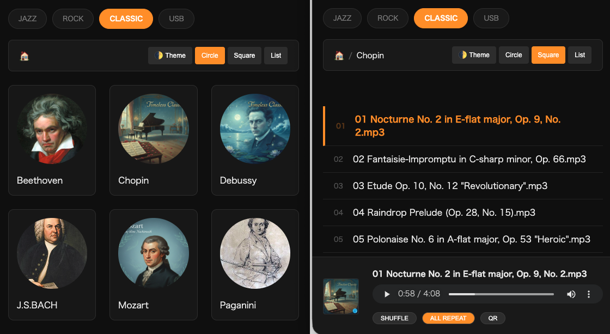

# mp3-dana (MP3棚)
A minimalist, folder-based web music player in a single PHP file.  
PHP 1ファイルで動作する、フォルダ構造を活かした軽量ミュージックプレイヤー。

  
   
  <i>Dark Mode: Circle view (Left) and Square/List view (Right)</i>

## Concept / コンセプト
**"A simple shelf for your music."** mp3-dana is a tiny script that turns your messy music directories into a functional web player instantly. No database, no complex installation—just drop and play.

**「音楽のための、シンプルな棚」** mp3-danaは、音楽フォルダを即座にWebプレイヤー化する軽量スクリプトです。データベースは不要。ファイルを置いて読み込むだけで、あなたの音楽ライブラリをブラウザで楽しめます。

## Features / 特徴
- **Zero Config**: Single-file PHP script (+ ID3 library). / PHP 1ファイルで動作。
- **Folder-Centric**: Respects your directory structure. / フォルダ構造をそのままリスペクト。
- **Rich Metadata**: Automatic extraction of cover art and lyrics from ID3 tags. / ID3タグからジャケット画像や歌詞を自動抽出。
- **Theme Support**: Dark and Light modes. / ダーク・ライトモード切替。
- **Private & Safe**: Designed for intranet/LAN use. / イントラネット・個人利用に最適化。
- **QR Sync**: (Optional) Scan to sync folders to your phone. / QRコードでスマホへの引き継ぎ。(qrcode.min.js が必要)

## Installation / 設置方法
1. Download `index.php` to your music directory. / `index.php` を音楽フォルダへ配置。
2. Place [getID3](https://www.getid3.org/) library in `/getid3`. / getID3ライブラリをフォルダに配置。
3. (Optional) Put `qrcode.min.js` next to `index.php`. / 任意で `qrcode.min.js` を配置。
4. Access via browser. / ブラウザでアクセス。

## Optional Features / 追加機能

You can unlock these powerful tools by adding small external libraries.  
外部ライブラリを追加することで、以下の便利な機能が利用可能になります。

- **QR Sync (via [qrcodejs](https://github.com/davidshimjs/qrcodejs))** Scan the QR code to instantly sync and open the current folder on your mobile device. Perfect for "handing over" your music from PC to phone.  
  **QR同期**: QRコードをスキャンして、現在開いているフォルダを即座にスマホで共有。PCからスマホへの「再生の引き継ぎ」に最適です。

## Notes & Limitations / 注意事項と制限

### Initial Loading Time / 初回の読み込み時間
Since this app does not use a database, it scans the directory and extracts album art on the fly. The first access to a folder may take some time as it generates a cache (`cover_cache.jpg`). Subsequent visits will be much faster.
本アプリはデータベースを使用せず、アクセス時にディレクトリをスキャンしてアルバムアートを抽出します。そのため、キャッシュ（`cover_cache.jpg`）を生成する初回アクセス時のみ、表示に時間がかかる場合があります。2回目以降は高速に動作します。

### Metadata Dependence / メタデータへの依存
The visual richness of your "shelf" depends on your ID3 tags. If your files don't have embedded cover art or lyrics, the experience might feel a bit plain. We recommend using tools like Mp3tag to organize your library.
「棚」の賑やかさは、ファイルのID3タグに依存します。画像や歌詞が埋め込まれていない場合、表示が寂しくなることがあります。快適な利用のために、Mp3tagなどのツールでライブラリを整理しておくことをお勧めします。

### No Playlist Feature / プレイリスト機能なし
This is a simple folder-based explorer. It does not support cross-folder playlists or database-style search. It is designed to let you enjoy music "album by album," just like picking a CD from a shelf.
本アプリはフォルダ構造をそのまま楽しむためのエクスプローラーです。フォルダを跨いだプレイリスト作成や検索機能はありません。棚からCDを選ぶように「アルバム単位」で音楽を楽しむスタイルに特化しています。

### File Permissions / 書き込み権限
The script needs write permission to create `cover_cache.jpg` in your music folders. If images don't appear, please check your server's directory permissions.
キャッシュ画像を生成するため、音楽フォルダへの書き込み権限が必要です。画像が表示されない場合は、サーバーのパーミッション設定を確認してください。

## Security Notice / セキュリティについて
This app is for **private intranet use only**. It has no authentication.  
本ツールは**イントラネット内での個人利用**を想定しています。認証機能はありませんので、インターネット上への直接公開は避けてください。

## License
MIT License

